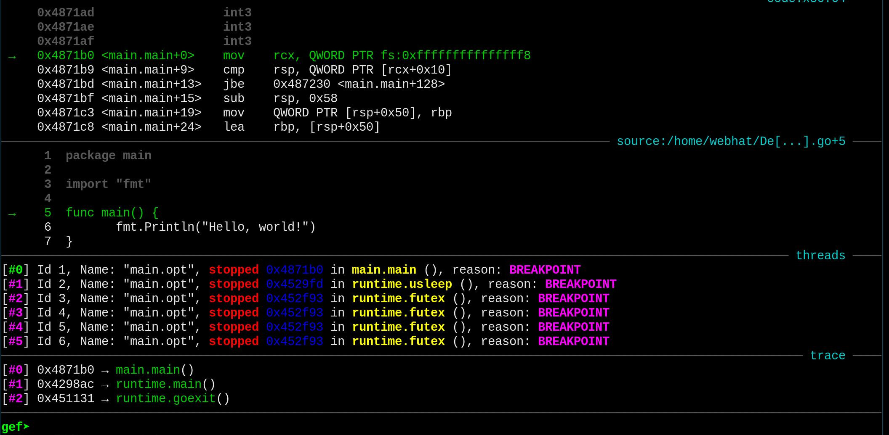

Golang Reverse Engineer

When we looked at `rust` we saw that it produced a unoptimized binary for debugging purposes, which from our perspective was good for reverse engineering, and only produced optimized binaries upon request. `go` on the other hand produces optimized binaries by default. To produce a non-optimized binary one needs to explicitly disable optimizations `-N` and inlining `-l`.

```
  $ go build -gcflags '-N -l'
```

Like last time `ltrace` doesn't reveal anything about the binary, not only are all the functions that are usually delegated to libraries are implemented from scratch, the binary is also statically linked, to make it more portable. So we can only see syscalls and signals using `strace`.

```ldd
  $ ldd main.opt
   not a dynamic executable
```

```ltrace
  $ ltrace main.opt
  Couldn't find .dynsym or .dynstr in "/proc/15175/exe"
  Hello, world!
```

```strace
  $ strace main.opt
  ...
  write(1, "Hello, world!\n", 14Hello, world!
  )         = 14
  ...
```

We can also see it here in `gdb`:


<details><summary>strace output</summary>

<p>

```strace
execve("./main.opt", ["./main.opt"], 0x7ffc8dbfb240 /* 46 vars */) = 0
arch_prctl(ARCH_SET_FS, 0x559650)       = 0
sched_getaffinity(0, 8192, [0, 1, 2, 3, 4, 5, 6, 7, 8, 9, 10, 11, 12, 13, 14, 15]) = 8
mmap(NULL, 262144, PROT_READ|PROT_WRITE, MAP_PRIVATE|MAP_ANONYMOUS, -1, 0) = 0x7ff9ef39f000
mmap(0xc000000000, 67108864, PROT_NONE, MAP_PRIVATE|MAP_ANONYMOUS, -1, 0) = 0xc000000000
mmap(0xc000000000, 67108864, PROT_READ|PROT_WRITE, MAP_PRIVATE|MAP_FIXED|MAP_ANONYMOUS, -1, 0) = 0xc000000000
mmap(NULL, 33554432, PROT_READ|PROT_WRITE, MAP_PRIVATE|MAP_ANONYMOUS, -1, 0) = 0x7ff9ed39f000
mmap(NULL, 2164736, PROT_READ|PROT_WRITE, MAP_PRIVATE|MAP_ANONYMOUS, -1, 0) = 0x7ff9ed18e000
mmap(NULL, 65536, PROT_READ|PROT_WRITE, MAP_PRIVATE|MAP_ANONYMOUS, -1, 0) = 0x7ff9ed17e000
mmap(NULL, 65536, PROT_READ|PROT_WRITE, MAP_PRIVATE|MAP_ANONYMOUS, -1, 0) = 0x7ff9ed16e000
rt_sigprocmask(SIG_SETMASK, NULL, [], 8) = 0
sigaltstack(NULL, {ss_sp=NULL, ss_flags=SS_DISABLE, ss_size=0}) = 0
sigaltstack({ss_sp=0xc000002000, ss_flags=0, ss_size=32768}, NULL) = 0
rt_sigprocmask(SIG_SETMASK, [], NULL, 8) = 0
gettid()                                = 15132
rt_sigaction(SIGHUP, NULL, {sa_handler=SIG_DFL, sa_mask=[], sa_flags=0}, 8) = 0
rt_sigaction(SIGHUP, {sa_handler=0x452cf0, sa_mask=~[], sa_flags=SA_RESTORER|SA_ONSTACK|SA_RESTART|SA_SIGINFO, sa_restorer=0x452e20}, NULL, 8) = 0
rt_sigaction(SIGINT, NULL, {sa_handler=SIG_DFL, sa_mask=[], sa_flags=0}, 8) = 0
rt_sigaction(SIGINT, {sa_handler=0x452cf0, sa_mask=~[], sa_flags=SA_RESTORER|SA_ONSTACK|SA_RESTART|SA_SIGINFO, sa_restorer=0x452e20}, NULL, 8) = 0
rt_sigaction(SIGQUIT, NULL, {sa_handler=SIG_DFL, sa_mask=[], sa_flags=0}, 8) = 0
rt_sigaction(SIGQUIT, {sa_handler=0x452cf0, sa_mask=~[], sa_flags=SA_RESTORER|SA_ONSTACK|SA_RESTART|SA_SIGINFO, sa_restorer=0x452e20}, NULL, 8) = 0
rt_sigaction(SIGILL, NULL, {sa_handler=SIG_DFL, sa_mask=[], sa_flags=0}, 8) = 0
rt_sigaction(SIGILL, {sa_handler=0x452cf0, sa_mask=~[], sa_flags=SA_RESTORER|SA_ONSTACK|SA_RESTART|SA_SIGINFO, sa_restorer=0x452e20}, NULL, 8) = 0
rt_sigaction(SIGTRAP, NULL, {sa_handler=SIG_DFL, sa_mask=[], sa_flags=0}, 8) = 0
rt_sigaction(SIGTRAP, {sa_handler=0x452cf0, sa_mask=~[], sa_flags=SA_RESTORER|SA_ONSTACK|SA_RESTART|SA_SIGINFO, sa_restorer=0x452e20}, NULL, 8) = 0
rt_sigaction(SIGABRT, NULL, {sa_handler=SIG_DFL, sa_mask=[], sa_flags=0}, 8) = 0
rt_sigaction(SIGABRT, {sa_handler=0x452cf0, sa_mask=~[], sa_flags=SA_RESTORER|SA_ONSTACK|SA_RESTART|SA_SIGINFO, sa_restorer=0x452e20}, NULL, 8) = 0
rt_sigaction(SIGBUS, NULL, {sa_handler=SIG_DFL, sa_mask=[], sa_flags=0}, 8) = 0
rt_sigaction(SIGBUS, {sa_handler=0x452cf0, sa_mask=~[], sa_flags=SA_RESTORER|SA_ONSTACK|SA_RESTART|SA_SIGINFO, sa_restorer=0x452e20}, NULL, 8) = 0
rt_sigaction(SIGFPE, NULL, {sa_handler=SIG_DFL, sa_mask=[], sa_flags=0}, 8) = 0
rt_sigaction(SIGFPE, {sa_handler=0x452cf0, sa_mask=~[], sa_flags=SA_RESTORER|SA_ONSTACK|SA_RESTART|SA_SIGINFO, sa_restorer=0x452e20}, NULL, 8) = 0
rt_sigaction(SIGUSR1, NULL, {sa_handler=SIG_DFL, sa_mask=[], sa_flags=0}, 8) = 0
rt_sigaction(SIGUSR1, {sa_handler=0x452cf0, sa_mask=~[], sa_flags=SA_RESTORER|SA_ONSTACK|SA_RESTART|SA_SIGINFO, sa_restorer=0x452e20}, NULL, 8) = 0
rt_sigaction(SIGSEGV, NULL, {sa_handler=SIG_DFL, sa_mask=[], sa_flags=0}, 8) = 0
rt_sigaction(SIGSEGV, {sa_handler=0x452cf0, sa_mask=~[], sa_flags=SA_RESTORER|SA_ONSTACK|SA_RESTART|SA_SIGINFO, sa_restorer=0x452e20}, NULL, 8) = 0
rt_sigaction(SIGUSR2, NULL, {sa_handler=SIG_DFL, sa_mask=[], sa_flags=0}, 8) = 0
rt_sigaction(SIGUSR2, {sa_handler=0x452cf0, sa_mask=~[], sa_flags=SA_RESTORER|SA_ONSTACK|SA_RESTART|SA_SIGINFO, sa_restorer=0x452e20}, NULL, 8) = 0
rt_sigaction(SIGPIPE, NULL, {sa_handler=SIG_DFL, sa_mask=[], sa_flags=0}, 8) = 0
rt_sigaction(SIGPIPE, {sa_handler=0x452cf0, sa_mask=~[], sa_flags=SA_RESTORER|SA_ONSTACK|SA_RESTART|SA_SIGINFO, sa_restorer=0x452e20}, NULL, 8) = 0
rt_sigaction(SIGALRM, NULL, {sa_handler=SIG_DFL, sa_mask=[], sa_flags=0}, 8) = 0
rt_sigaction(SIGALRM, {sa_handler=0x452cf0, sa_mask=~[], sa_flags=SA_RESTORER|SA_ONSTACK|SA_RESTART|SA_SIGINFO, sa_restorer=0x452e20}, NULL, 8) = 0
rt_sigaction(SIGTERM, NULL, {sa_handler=SIG_DFL, sa_mask=[], sa_flags=0}, 8) = 0
rt_sigaction(SIGTERM, {sa_handler=0x452cf0, sa_mask=~[], sa_flags=SA_RESTORER|SA_ONSTACK|SA_RESTART|SA_SIGINFO, sa_restorer=0x452e20}, NULL, 8) = 0
rt_sigaction(SIGSTKFLT, NULL, {sa_handler=SIG_DFL, sa_mask=[], sa_flags=0}, 8) = 0
rt_sigaction(SIGSTKFLT, {sa_handler=0x452cf0, sa_mask=~[], sa_flags=SA_RESTORER|SA_ONSTACK|SA_RESTART|SA_SIGINFO, sa_restorer=0x452e20}, NULL, 8) = 0
rt_sigaction(SIGCHLD, NULL, {sa_handler=SIG_DFL, sa_mask=[], sa_flags=0}, 8) = 0
rt_sigaction(SIGCHLD, {sa_handler=0x452cf0, sa_mask=~[], sa_flags=SA_RESTORER|SA_ONSTACK|SA_RESTART|SA_SIGINFO, sa_restorer=0x452e20}, NULL, 8) = 0
rt_sigaction(SIGURG, NULL, {sa_handler=SIG_DFL, sa_mask=[], sa_flags=0}, 8) = 0
rt_sigaction(SIGURG, {sa_handler=0x452cf0, sa_mask=~[], sa_flags=SA_RESTORER|SA_ONSTACK|SA_RESTART|SA_SIGINFO, sa_restorer=0x452e20}, NULL, 8) = 0
rt_sigaction(SIGXCPU, NULL, {sa_handler=SIG_DFL, sa_mask=[], sa_flags=0}, 8) = 0
rt_sigaction(SIGXCPU, {sa_handler=0x452cf0, sa_mask=~[], sa_flags=SA_RESTORER|SA_ONSTACK|SA_RESTART|SA_SIGINFO, sa_restorer=0x452e20}, NULL, 8) = 0
rt_sigaction(SIGXFSZ, NULL, {sa_handler=SIG_DFL, sa_mask=[], sa_flags=0}, 8) = 0
rt_sigaction(SIGXFSZ, {sa_handler=0x452cf0, sa_mask=~[], sa_flags=SA_RESTORER|SA_ONSTACK|SA_RESTART|SA_SIGINFO, sa_restorer=0x452e20}, NULL, 8) = 0
rt_sigaction(SIGVTALRM, NULL, {sa_handler=SIG_DFL, sa_mask=[], sa_flags=0}, 8) = 0
rt_sigaction(SIGVTALRM, {sa_handler=0x452cf0, sa_mask=~[], sa_flags=SA_RESTORER|SA_ONSTACK|SA_RESTART|SA_SIGINFO, sa_restorer=0x452e20}, NULL, 8) = 0
rt_sigaction(SIGPROF, NULL, {sa_handler=SIG_DFL, sa_mask=[], sa_flags=0}, 8) = 0
rt_sigaction(SIGPROF, {sa_handler=0x452cf0, sa_mask=~[], sa_flags=SA_RESTORER|SA_ONSTACK|SA_RESTART|SA_SIGINFO, sa_restorer=0x452e20}, NULL, 8) = 0
rt_sigaction(SIGWINCH, NULL, {sa_handler=SIG_DFL, sa_mask=[], sa_flags=0}, 8) = 0
rt_sigaction(SIGWINCH, {sa_handler=0x452cf0, sa_mask=~[], sa_flags=SA_RESTORER|SA_ONSTACK|SA_RESTART|SA_SIGINFO, sa_restorer=0x452e20}, NULL, 8) = 0
rt_sigaction(SIGIO, NULL, {sa_handler=SIG_DFL, sa_mask=[], sa_flags=0}, 8) = 0
rt_sigaction(SIGIO, {sa_handler=0x452cf0, sa_mask=~[], sa_flags=SA_RESTORER|SA_ONSTACK|SA_RESTART|SA_SIGINFO, sa_restorer=0x452e20}, NULL, 8) = 0
rt_sigaction(SIGPWR, NULL, {sa_handler=SIG_DFL, sa_mask=[], sa_flags=0}, 8) = 0
rt_sigaction(SIGPWR, {sa_handler=0x452cf0, sa_mask=~[], sa_flags=SA_RESTORER|SA_ONSTACK|SA_RESTART|SA_SIGINFO, sa_restorer=0x452e20}, NULL, 8) = 0
rt_sigaction(SIGSYS, NULL, {sa_handler=SIG_DFL, sa_mask=[], sa_flags=0}, 8) = 0
rt_sigaction(SIGSYS, {sa_handler=0x452cf0, sa_mask=~[], sa_flags=SA_RESTORER|SA_ONSTACK|SA_RESTART|SA_SIGINFO, sa_restorer=0x452e20}, NULL, 8) = 0
rt_sigaction(SIGRTMIN, NULL, {sa_handler=SIG_DFL, sa_mask=[], sa_flags=0}, 8) = 0
rt_sigaction(SIGRT_1, NULL, {sa_handler=SIG_DFL, sa_mask=[], sa_flags=0}, 8) = 0
rt_sigaction(SIGRT_2, NULL, {sa_handler=SIG_DFL, sa_mask=[], sa_flags=0}, 8) = 0
rt_sigaction(SIGRT_2, {sa_handler=0x452cf0, sa_mask=~[], sa_flags=SA_RESTORER|SA_ONSTACK|SA_RESTART|SA_SIGINFO, sa_restorer=0x452e20}, NULL, 8) = 0
rt_sigaction(SIGRT_3, NULL, {sa_handler=SIG_DFL, sa_mask=[], sa_flags=0}, 8) = 0
rt_sigaction(SIGRT_3, {sa_handler=0x452cf0, sa_mask=~[], sa_flags=SA_RESTORER|SA_ONSTACK|SA_RESTART|SA_SIGINFO, sa_restorer=0x452e20}, NULL, 8) = 0
rt_sigaction(SIGRT_4, NULL, {sa_handler=SIG_DFL, sa_mask=[], sa_flags=0}, 8) = 0
rt_sigaction(SIGRT_4, {sa_handler=0x452cf0, sa_mask=~[], sa_flags=SA_RESTORER|SA_ONSTACK|SA_RESTART|SA_SIGINFO, sa_restorer=0x452e20}, NULL, 8) = 0
rt_sigaction(SIGRT_5, NULL, {sa_handler=SIG_DFL, sa_mask=[], sa_flags=0}, 8) = 0
rt_sigaction(SIGRT_5, {sa_handler=0x452cf0, sa_mask=~[], sa_flags=SA_RESTORER|SA_ONSTACK|SA_RESTART|SA_SIGINFO, sa_restorer=0x452e20}, NULL, 8) = 0
rt_sigaction(SIGRT_6, NULL, {sa_handler=SIG_DFL, sa_mask=[], sa_flags=0}, 8) = 0
rt_sigaction(SIGRT_6, {sa_handler=0x452cf0, sa_mask=~[], sa_flags=SA_RESTORER|SA_ONSTACK|SA_RESTART|SA_SIGINFO, sa_restorer=0x452e20}, NULL, 8) = 0
rt_sigaction(SIGRT_7, NULL, {sa_handler=SIG_DFL, sa_mask=[], sa_flags=0}, 8) = 0
rt_sigaction(SIGRT_7, {sa_handler=0x452cf0, sa_mask=~[], sa_flags=SA_RESTORER|SA_ONSTACK|SA_RESTART|SA_SIGINFO, sa_restorer=0x452e20}, NULL, 8) = 0
rt_sigaction(SIGRT_8, NULL, {sa_handler=SIG_DFL, sa_mask=[], sa_flags=0}, 8) = 0
rt_sigaction(SIGRT_8, {sa_handler=0x452cf0, sa_mask=~[], sa_flags=SA_RESTORER|SA_ONSTACK|SA_RESTART|SA_SIGINFO, sa_restorer=0x452e20}, NULL, 8) = 0
rt_sigaction(SIGRT_9, NULL, {sa_handler=SIG_DFL, sa_mask=[], sa_flags=0}, 8) = 0
rt_sigaction(SIGRT_9, {sa_handler=0x452cf0, sa_mask=~[], sa_flags=SA_RESTORER|SA_ONSTACK|SA_RESTART|SA_SIGINFO, sa_restorer=0x452e20}, NULL, 8) = 0
rt_sigaction(SIGRT_10, NULL, {sa_handler=SIG_DFL, sa_mask=[], sa_flags=0}, 8) = 0
rt_sigaction(SIGRT_10, {sa_handler=0x452cf0, sa_mask=~[], sa_flags=SA_RESTORER|SA_ONSTACK|SA_RESTART|SA_SIGINFO, sa_restorer=0x452e20}, NULL, 8) = 0
rt_sigaction(SIGRT_11, NULL, {sa_handler=SIG_DFL, sa_mask=[], sa_flags=0}, 8) = 0
rt_sigaction(SIGRT_11, {sa_handler=0x452cf0, sa_mask=~[], sa_flags=SA_RESTORER|SA_ONSTACK|SA_RESTART|SA_SIGINFO, sa_restorer=0x452e20}, NULL, 8) = 0
rt_sigaction(SIGRT_12, NULL, {sa_handler=SIG_DFL, sa_mask=[], sa_flags=0}, 8) = 0
rt_sigaction(SIGRT_12, {sa_handler=0x452cf0, sa_mask=~[], sa_flags=SA_RESTORER|SA_ONSTACK|SA_RESTART|SA_SIGINFO, sa_restorer=0x452e20}, NULL, 8) = 0
rt_sigaction(SIGRT_13, NULL, {sa_handler=SIG_DFL, sa_mask=[], sa_flags=0}, 8) = 0
rt_sigaction(SIGRT_13, {sa_handler=0x452cf0, sa_mask=~[], sa_flags=SA_RESTORER|SA_ONSTACK|SA_RESTART|SA_SIGINFO, sa_restorer=0x452e20}, NULL, 8) = 0
rt_sigaction(SIGRT_14, NULL, {sa_handler=SIG_DFL, sa_mask=[], sa_flags=0}, 8) = 0
rt_sigaction(SIGRT_14, {sa_handler=0x452cf0, sa_mask=~[], sa_flags=SA_RESTORER|SA_ONSTACK|SA_RESTART|SA_SIGINFO, sa_restorer=0x452e20}, NULL, 8) = 0
rt_sigaction(SIGRT_15, NULL, {sa_handler=SIG_DFL, sa_mask=[], sa_flags=0}, 8) = 0
rt_sigaction(SIGRT_15, {sa_handler=0x452cf0, sa_mask=~[], sa_flags=SA_RESTORER|SA_ONSTACK|SA_RESTART|SA_SIGINFO, sa_restorer=0x452e20}, NULL, 8) = 0
rt_sigaction(SIGRT_16, NULL, {sa_handler=SIG_DFL, sa_mask=[], sa_flags=0}, 8) = 0
rt_sigaction(SIGRT_16, {sa_handler=0x452cf0, sa_mask=~[], sa_flags=SA_RESTORER|SA_ONSTACK|SA_RESTART|SA_SIGINFO, sa_restorer=0x452e20}, NULL, 8) = 0
rt_sigaction(SIGRT_17, NULL, {sa_handler=SIG_DFL, sa_mask=[], sa_flags=0}, 8) = 0
rt_sigaction(SIGRT_17, {sa_handler=0x452cf0, sa_mask=~[], sa_flags=SA_RESTORER|SA_ONSTACK|SA_RESTART|SA_SIGINFO, sa_restorer=0x452e20}, NULL, 8) = 0
rt_sigaction(SIGRT_18, NULL, {sa_handler=SIG_DFL, sa_mask=[], sa_flags=0}, 8) = 0
rt_sigaction(SIGRT_18, {sa_handler=0x452cf0, sa_mask=~[], sa_flags=SA_RESTORER|SA_ONSTACK|SA_RESTART|SA_SIGINFO, sa_restorer=0x452e20}, NULL, 8) = 0
rt_sigaction(SIGRT_19, NULL, {sa_handler=SIG_DFL, sa_mask=[], sa_flags=0}, 8) = 0
rt_sigaction(SIGRT_19, {sa_handler=0x452cf0, sa_mask=~[], sa_flags=SA_RESTORER|SA_ONSTACK|SA_RESTART|SA_SIGINFO, sa_restorer=0x452e20}, NULL, 8) = 0
rt_sigaction(SIGRT_20, NULL, {sa_handler=SIG_DFL, sa_mask=[], sa_flags=0}, 8) = 0
rt_sigaction(SIGRT_20, {sa_handler=0x452cf0, sa_mask=~[], sa_flags=SA_RESTORER|SA_ONSTACK|SA_RESTART|SA_SIGINFO, sa_restorer=0x452e20}, NULL, 8) = 0
rt_sigaction(SIGRT_21, NULL, {sa_handler=SIG_DFL, sa_mask=[], sa_flags=0}, 8) = 0
rt_sigaction(SIGRT_21, {sa_handler=0x452cf0, sa_mask=~[], sa_flags=SA_RESTORER|SA_ONSTACK|SA_RESTART|SA_SIGINFO, sa_restorer=0x452e20}, NULL, 8) = 0
rt_sigaction(SIGRT_22, NULL, {sa_handler=SIG_DFL, sa_mask=[], sa_flags=0}, 8) = 0
rt_sigaction(SIGRT_22, {sa_handler=0x452cf0, sa_mask=~[], sa_flags=SA_RESTORER|SA_ONSTACK|SA_RESTART|SA_SIGINFO, sa_restorer=0x452e20}, NULL, 8) = 0
rt_sigaction(SIGRT_23, NULL, {sa_handler=SIG_DFL, sa_mask=[], sa_flags=0}, 8) = 0
rt_sigaction(SIGRT_23, {sa_handler=0x452cf0, sa_mask=~[], sa_flags=SA_RESTORER|SA_ONSTACK|SA_RESTART|SA_SIGINFO, sa_restorer=0x452e20}, NULL, 8) = 0
rt_sigaction(SIGRT_24, NULL, {sa_handler=SIG_DFL, sa_mask=[], sa_flags=0}, 8) = 0
rt_sigaction(SIGRT_24, {sa_handler=0x452cf0, sa_mask=~[], sa_flags=SA_RESTORER|SA_ONSTACK|SA_RESTART|SA_SIGINFO, sa_restorer=0x452e20}, NULL, 8) = 0
rt_sigaction(SIGRT_25, NULL, {sa_handler=SIG_DFL, sa_mask=[], sa_flags=0}, 8) = 0
rt_sigaction(SIGRT_25, {sa_handler=0x452cf0, sa_mask=~[], sa_flags=SA_RESTORER|SA_ONSTACK|SA_RESTART|SA_SIGINFO, sa_restorer=0x452e20}, NULL, 8) = 0
rt_sigaction(SIGRT_26, NULL, {sa_handler=SIG_DFL, sa_mask=[], sa_flags=0}, 8) = 0
rt_sigaction(SIGRT_26, {sa_handler=0x452cf0, sa_mask=~[], sa_flags=SA_RESTORER|SA_ONSTACK|SA_RESTART|SA_SIGINFO, sa_restorer=0x452e20}, NULL, 8) = 0
rt_sigaction(SIGRT_27, NULL, {sa_handler=SIG_DFL, sa_mask=[], sa_flags=0}, 8) = 0
rt_sigaction(SIGRT_27, {sa_handler=0x452cf0, sa_mask=~[], sa_flags=SA_RESTORER|SA_ONSTACK|SA_RESTART|SA_SIGINFO, sa_restorer=0x452e20}, NULL, 8) = 0
rt_sigaction(SIGRT_28, NULL, {sa_handler=SIG_DFL, sa_mask=[], sa_flags=0}, 8) = 0
rt_sigaction(SIGRT_28, {sa_handler=0x452cf0, sa_mask=~[], sa_flags=SA_RESTORER|SA_ONSTACK|SA_RESTART|SA_SIGINFO, sa_restorer=0x452e20}, NULL, 8) = 0
rt_sigaction(SIGRT_29, NULL, {sa_handler=SIG_DFL, sa_mask=[], sa_flags=0}, 8) = 0
rt_sigaction(SIGRT_29, {sa_handler=0x452cf0, sa_mask=~[], sa_flags=SA_RESTORER|SA_ONSTACK|SA_RESTART|SA_SIGINFO, sa_restorer=0x452e20}, NULL, 8) = 0
rt_sigaction(SIGRT_30, NULL, {sa_handler=SIG_DFL, sa_mask=[], sa_flags=0}, 8) = 0
rt_sigaction(SIGRT_30, {sa_handler=0x452cf0, sa_mask=~[], sa_flags=SA_RESTORER|SA_ONSTACK|SA_RESTART|SA_SIGINFO, sa_restorer=0x452e20}, NULL, 8) = 0
rt_sigaction(SIGRT_31, NULL, {sa_handler=SIG_DFL, sa_mask=[], sa_flags=0}, 8) = 0
rt_sigaction(SIGRT_31, {sa_handler=0x452cf0, sa_mask=~[], sa_flags=SA_RESTORER|SA_ONSTACK|SA_RESTART|SA_SIGINFO, sa_restorer=0x452e20}, NULL, 8) = 0
rt_sigaction(SIGRT_32, NULL, {sa_handler=SIG_DFL, sa_mask=[], sa_flags=0}, 8) = 0
rt_sigaction(SIGRT_32, {sa_handler=0x452cf0, sa_mask=~[], sa_flags=SA_RESTORER|SA_ONSTACK|SA_RESTART|SA_SIGINFO, sa_restorer=0x452e20}, NULL, 8) = 0
rt_sigprocmask(SIG_SETMASK, ~[], [], 8) = 0
clone(child_stack=0xc000064000, flags=CLONE_VM|CLONE_FS|CLONE_FILES|CLONE_SIGHAND|CLONE_THREAD|CLONE_SYSVSEM) = 15133
rt_sigprocmask(SIG_SETMASK, [], NULL, 8) = 0
rt_sigprocmask(SIG_SETMASK, ~[], [], 8) = 0
clone(child_stack=0xc000066000, flags=CLONE_VM|CLONE_FS|CLONE_FILES|CLONE_SIGHAND|CLONE_THREAD|CLONE_SYSVSEM) = 15134
rt_sigprocmask(SIG_SETMASK, [], NULL, 8) = 0
rt_sigprocmask(SIG_SETMASK, ~[], [], 8) = 0
clone(child_stack=0xc000060000, flags=CLONE_VM|CLONE_FS|CLONE_FILES|CLONE_SIGHAND|CLONE_THREAD|CLONE_SYSVSEM) = 15136
rt_sigprocmask(SIG_SETMASK, [], NULL, 8) = 0
futex(0xc000054848, FUTEX_WAKE_PRIVATE, 1) = 1
futex(0xc000070148, FUTEX_WAKE_PRIVATE, 1) = 1
readlinkat(AT_FDCWD, "/proc/self/exe", "/home/webhat/Development/reverse"..., 128) = 48
futex(0x559010, FUTEX_WAKE_PRIVATE, 1)  = 1
futex(0x558f10, FUTEX_WAKE_PRIVATE, 1)  = 1
fcntl(0, F_GETFL)                       = 0x402 (flags O_RDWR|O_APPEND)
futex(0xc0000544c8, FUTEX_WAKE_PRIVATE, 1) = 1
mmap(NULL, 262144, PROT_READ|PROT_WRITE, MAP_PRIVATE|MAP_ANONYMOUS, -1, 0) = 0x7ff9ed12e000
fcntl(1, F_GETFL)                       = 0x1 (flags O_WRONLY)
fcntl(2, F_GETFL)                       = 0x1 (flags O_WRONLY)
write(1, "Hello, world!\n", 14Hello, world!
)         = 14
exit_group(0)                           = ?
+++ exited with 0 +++
```
</p>
</details>

From the code produced by the compiler we can see that it uses a number of wrappers to call the syscall

```
  00000000004871b0 <main.main>:
    ...
    4871ee:       48 8b 05 fb 15 0d 00    mov    0xd15fb(%rip),%rax        # 5587f0 <os.Stdout>
    4871f5:       48 8d 0d c4 9a 04 00    lea    0x49ac4(%rip),%rcx        # 4d0cc0 <go.itab.*os.File,io.Writer>
    4871fc:       48 89 0c 24             mov    %rcx,(%rsp)
    487200:       48 89 44 24 08          mov    %rax,0x8(%rsp)
    487205:       48 8d 44 24 40          lea    0x40(%rsp),%rax
    48720a:       48 89 44 24 10          mov    %rax,0x10(%rsp)
    48720f:       48 c7 44 24 18 01 00    movq   $0x1,0x18(%rsp)
    487216:       00 00
    487218:       48 c7 44 24 20 01 00    movq   $0x1,0x20(%rsp)
    48721f:       00 00
    487221:       e8 3a 99 ff ff          callq  480b60 <fmt.Fprintln>
    ...
```

```
     0x47b3e2 <syscall.Syscall+34> mov    r9, 0x0
     0x47b3e9 <syscall.Syscall+41> mov    rax, QWORD PTR [rsp+0x8]
     0x47b3ee <syscall.Syscall+46> syscall
 →   0x47b3f0 <syscall.Syscall+48> cmp    rax, 0xfffffffffffff001
     0x47b3f6 <syscall.Syscall+54> jbe    0x47b418 <syscall.Syscall+88>
     0x47b3f8 <syscall.Syscall+56> mov    QWORD PTR [rsp+0x28], 0xffffffffffffffff
     0x47b401 <syscall.Syscall+65> mov    QWORD PTR [rsp+0x30], 0x0
     0x47b40a <syscall.Syscall+74> neg    rax
     0x47b40d <syscall.Syscall+77> mov    QWORD PTR [rsp+0x38], rax
────────────────────────────────────────────────────────────────────────────────────────────────────── source:/home/webhat/De[...].s+27 ────
     22         MOVQ    $0, R10
     23         MOVQ    $0, R8
     24         MOVQ    $0, R9
     25         MOVQ    trap+0(FP), AX  // syscall entry
     26         SYSCALL
 →   27         CMPQ    AX, $0xfffffffffffff001
     28         JLS     ok
     29         MOVQ    $-1, r1+32(FP)
     30         MOVQ    $0, r2+40(FP)
     31         NEGQ    AX
     32         MOVQ    AX, err+48(FP)
─────────────────────────────────────────────────────────────────────────────────────────────────────────────────────────────── threads ────
[#0] Id 1, Name: "main.opt", stopped 0x47b3f0 in syscall.Syscall (), reason: SINGLE STEP
[#1] Id 2, Name: "main.opt", stopped 0x4529fd in runtime.usleep (), reason: SINGLE STEP
[#2] Id 3, Name: "main.opt", stopped 0x452f93 in runtime.futex (), reason: SINGLE STEP
[#3] Id 4, Name: "main.opt", stopped 0x452f93 in runtime.futex (), reason: SINGLE STEP
[#4] Id 5, Name: "main.opt", stopped 0x452f93 in runtime.futex (), reason: SINGLE STEP
───────────────────────────────────────────────────────────────────────────────────────────────────────────────────────────────── trace ────
[#0] 0x47b3f0 → syscall.Syscall()
[#1] 0x47affa → syscall.write(fd=0x1, p={
  array = 0xc0000aa010 "Hello, world!\n",
  len = 0xe,
  cap = <synthetic pointer>
}, n=<optimised out>, err=<optimised out>)
[#2] 0x47c7d9 → syscall.Write(fd=0x1, p={
  array = 0xe <error: Cannot access memory at address 0xe>,
  len = 0xe,
  cap = <optimised out>
}, n=<optimised out>, err=<optimised out>)
[#3] 0x47c7d9 → internal/poll.(*FD).Write(fd=0xc0000b8060, p={
  array = 0xc0000aa010 "Hello, world!\n",
  len = 0xe,
  cap = 0x10
}, ~r1=<optimised out>, ~r2=<optimised out>)
[#4] 0x47cf16 → os.(*File).write(f=0xc0000b6008, b={
  array = 0xc0000aa010 "Hello, world!\n",
  len = 0xe,
  cap = 0x10
}, n=<optimised out>, err=<optimised out>)
[#5] 0x47cf16 → os.(*File).Write(f=0xc0000b6008, b={
  array = 0xc0000aa010 "Hello, world!\n",
  len = 0xe,
  cap = 0x10
}, n=<optimised out>, err=<optimised out>)
[#6] 0x480beb → fmt.Fprintln(w={
  tab = 0x4d0cc0 <File,io.Writer>,
  data = 0xc0000b6008
}, a={
  array = 0xc0000b0f78,
  len = 0x1,
  cap = 0x1
}, n=<optimised out>, err=<optimised out>)
[#7] 0x487226 → fmt.Println(a=<optimised out>, n=<optimised out>, err=<optimised out>)
[#8] 0x487226 → main.main()
[#9] 0x4298ac → runtime.main()
```


## Functions

In stripped binaries it's sometimes hard to determine where function start, we can use the ending `ret` of the previous fuction as a guide, and this will not always be acurate. For x86_64 binaries the signature to find a function we can use is the following `mov` instruction for most common functions, functions using unsafe code may have different signatures.

```asm
  mov    rcx,QWORD PTR fs:0xfffffffffffffff8 // 64 48 8b 0c 25 f8 ff ff ff 
```

In 386 we have most luck using the following instructions as a guide

```asm
  mov    ecx,DWORD PTR gs:0x0     // 65 8b 0d 00 00 00 00  *this one doesn't always occur*
  mov    ecx,DWORD PTR [ecx-0x4]  // 8b 89 fc ff ff ff   
  cmp    esp,DWORD PTR [ecx+0x8]  // 3b 61 08            
```

And in arm32 we have most luck using the following instructions as a guide

```asm
  ldr r1, [sl, #8] // e5 9a 10 08  
  cmp sp, r1       // e1 5d 00 01  
```

## Main


When we look at the output of `nm` we see that the function references don't need to be demangled, this is because user-level names are used rather than low-level symbols.

```nm
  $ nm main.opt |grep main
  0000000000487240 T main.init
  0000000000573f07 B main.initdone.
  00000000004871b0 T main.main
  00000000004cfde0 r main.main.stkobj
  00000000004cf7b0 R main.statictmp_0
  00000000004296a0 T runtime.main
  000000000044e0c0 T runtime.main.func1
  000000000044e110 T runtime.main.func2
  0000000000558868 B runtime.main_init_done
  00000000004cf4b0 R runtime.mainPC
  0000000000573f1a B runtime.mainStarted
```

As we can see below `main.main` in the initial entry of the go code.


```
     0x4871ad                  int3
     0x4871ae                  int3
     0x4871af                  int3
 →   0x4871b0 <main.main+0>    mov    rcx, QWORD PTR fs:0xfffffffffffffff8
     0x4871b9 <main.main+9>    cmp    rsp, QWORD PTR [rcx+0x10]
     0x4871bd <main.main+13>   jbe    0x487230 <main.main+128>
     0x4871bf <main.main+15>   sub    rsp, 0x58
     0x4871c3 <main.main+19>   mov    QWORD PTR [rsp+0x50], rbp
     0x4871c8 <main.main+24>   lea    rbp, [rsp+0x50]
───────────────────────────────────────────────────────────────────────────────────── source:/home/webhat/De[...].go+5 ────
      1  package main
      2
      3  import "fmt"
      4
 →    5  func main() {
      6         fmt.Println("Hello, world!")
      7  }
──────────────────────────────────────────────────────────────────────────────────────────────────────────────── trace ────
[#0] 0x4871b0 → main.main()
[#1] 0x4298ac → runtime.main()
[#2] 0x451131 → runtime.goexit()
```




## Goroutines

We also see that there are already 5 other threads besides the main thread, if you have never worked with go before then you may not know that user-space threading, comparible to `libpth` or `green-threads`, model is used, they call this Goroutines. This allows the binary to be more portible and not rely as mucht on the system-level threading model. This also means that asumptions that can be made when reverse engineering a single threaded application will not hold when reverse engineering a multi-threaded application.


```go
  1 package main
  2
  3 import "fmt"
  4
  5 func main() {
  6         ch := make(chan int)
  7
  8         go func(ch chan int) {
  9                 fmt.Println("Hello threading world!")
 10                 ch <- 1
 11         }(ch)
 12
 13         ret := <-ch // in this example this blocks the thread
 14         fmt.Println(ret)
 15 }
```

```gdb
───────────────────────────────────────────────────────────────────────────────────────────────────────────── threads ────
[#0] Id 1, Name: "main.opt", stopped 0x4871b0 in main.main (), reason: BREAKPOINT
[#1] Id 2, Name: "main.opt", stopped 0x4529fd in runtime.usleep (), reason: BREAKPOINT
[#2] Id 3, Name: "main.opt", stopped 0x452f93 in runtime.futex (), reason: BREAKPOINT
[#3] Id 4, Name: "main.opt", stopped 0x452f93 in runtime.futex (), reason: BREAKPOINT
[#4] Id 5, Name: "main.opt", stopped 0x452f93 in runtime.futex (), reason: BREAKPOINT
[#5] Id 6, Name: "main.opt", stopped 0x452f93 in runtime.futex (), reason: BREAKPOINT
```

Ofcourse it is possible to skip between threads in gdb using `thread` **&lt;nr>**, this will, for the most part, not work in go as it uses user-level threads.

```gdb
─────────────────────────────────────────────────────────────────────────────────────────────────────────────────────────────── threads ────
[#0] Id 1, Name: "main.opt", stopped 0x430af3 in runtime.exitsyscall (), reason: SINGLE STEP
[#1] Id 2, Name: "main.opt", stopped 0x452a06 in runtime.usleep (), reason: SINGLE STEP
[#2] Id 3, Name: "main.opt", stopped 0x452f93 in runtime.futex (), reason: SINGLE STEP
[#3] Id 4, Name: "main.opt", stopped 0x452f93 in runtime.futex (), reason: SINGLE STEP
[#4] Id 5, Name: "main.opt", stopped 0x452f93 in runtime.futex (), reason: SINGLE STEP
```

When creating a goroutine generally [`runtime.newproc`](https://golang.org/src/runtime/proc.go?s=96077:96113#L3366) is called, if we examine the decompiled code from line 8, we see that this function is called with 2 arguments and `int32` and a function pointer to the closure. It then passes it in a closure to `runtime.systemstack` _"systemstack runs fn on a system stack. If systemstack is called from the per-OS-thread (g0) stack, or if systemstack is called from the signal handling (gsignal) stack, systemstack calls fn directly and returns. Otherwise, systemstack is being called from the limited stack of an ordinary goroutine. In this case, systemstack switches to the per-OS-thread stack, calls fn, and switches back. It is common to use a func literal as the argument, in order to share inputs and outputs with the code around the call to system stack"<sup>[2](https://golang.org/pkg/runtime/?m=all#systemstack)</sup>_

```go
  8         go func(ch chan int) {
```

During static analysis of this assembly the code loads a pointer `0x4bfe30` which points to the closure `main.main.func1`, in our example the main thread running `main.main` blocks, this means that go will spawn a new system-evel thread is spawned to exceute the goroutine. Unless a goroutine blocks another thread is usually not spawned unless for a specific other reason, which is beyond the scope of this article.

```objdump
  ...
  4871ea:	48 8b 44 24 10       	mov    rax,QWORD PTR [rsp+0x10]
  4871ef:	48 89 44 24 48       	mov    QWORD PTR [rsp+0x48],rax
  4871f4:	c7 04 24 08 00 00 00 	mov    DWORD PTR [rsp],0x8
  4871fb:	48 8d 0d 2e 8c 03 00 	lea    rcx,[rip+0x38c2e]        # 4bfe30 <go.func.*+0x74>
  487202:	48 89 4c 24 08       	mov    QWORD PTR [rsp+0x8],rcx
  487207:	e8 e4 9e fa ff       	call   4310f0 <runtime.newproc>
  ...
```


  `set scheduler-locking on` gdb

#### More on threads

  https://codeburst.io/why-goroutines-are-not-lightweight-threads-7c460c1f155f


### Channels

*"Channels are a typed conduit through which you can send and receive values with the channel operator ..."<sup>[1](https://tour.golang.org/concurrency/2)</sup>* 


runtime.makechan

 →    6         ch := make(chan int)

runtime.chansend

```gdb
  gef➤  print c
  $5 = (runtime.hchan *) 0xc00009a000
  gef➤  print *c
  $6 = {
    qcount = 0x0,
    dataqsiz = 0x1,
    buf = 0xc00009a060,
    elemsize = 0x8,
    closed = 0x0,
    elemtype = 0x497c20,
    sendx = 0x0,
    recvx = 0x0,
    recvq = {
      first = 0xc00009e000,
      last = 0xc00009e000
    },
    sendq = {
      first = 0x0,
      last = 0x0
    },
    lock = {
      key = 0x0
    }
  }
```

runtime.chanrecv

 →   13         ret := <-ch


```
 chanrecv receives on channel c and writes the received data to ep.
 ep may be nil, in which case received data is ignored.
 If block == false and no elements are available, returns (false, false).
 Otherwise, if c is closed, zeros *ep and returns (true, false).
 Otherwise, fills in *ep with an element and returns (true, true).
 A non-nil ep must point to the heap or the caller's stack.
```

```gdb
     0x405220 <runtime.chanrecv+0> mov    rcx, QWORD PTR fs:0xfffffffffffffff8
     0x405229 <runtime.chanrecv+9> lea    rax, [rsp-0x8]
     0x40522e <runtime.chanrecv+14> cmp    rax, QWORD PTR [rcx+0x10]
 →   0x405232 <runtime.chanrecv+18> jbe    0x4058c9 <runtime.chanrecv+1705>     TAKEN [Reason: C || Z]
   ↳    0x4058c9 <runtime.chanrecv+1705> call   0x44f340 <runtime.morestack_noctxt>
        0x4058ce <runtime.chanrecv+1710> jmp    0x405220 <runtime.chanrecv>
```


chanbuf


